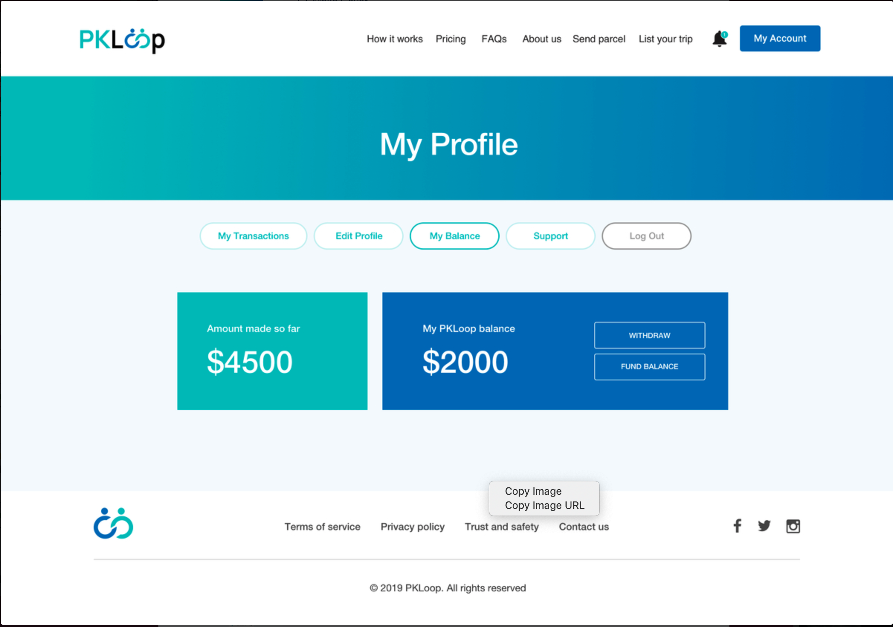

# BACKEND API FOR PKLOOP

## A Solution for connecting senders with travellers going in the same direction for parcel delivery

## BACKEND API - NODEJS, MONGODB, EXPRESS

### server.js - main server file: running app on port and db connection

### controller - main functions

### models - description for data

### routes - file routes

